# P3 — Diseño de Arquitectura: Plataforma de Procesamiento de Transacciones Bancarias

Software Avanzado — Segundo Semestre 2026

## Índice

1. [Contexto y problema a resolver](#1-contexto-y-problema-a-resolver)
2. [Diagrama de Arquitectura General](#2-diagrama-de-arquitectura-general)
3. [Integración con el módulo de autenticación de la Práctica 2](#3-integración-con-el-módulo-de-autenticación-de-la-práctica-2)
4. [Diseño de microservicios](#4-diseño-de-microservicios)
5. [Diagramas ER por microservicio](#5-diagramas-er-por-microservicio)
6. [Diagramas de clases UML por microservicio](#6-diagramas-de-clases-uml-por-microservicio)
7. [Flujo de aprobación de 3 pasos (maker-checker-authorizer)](#7-flujo-de-aprobación-de-3-pasos-maker-checker-authorizer)
8. [Diagramas de secuencia — flujos críticos](#8-diagramas-de-secuencia--flujos-críticos)
9. [Diagrama de componentes](#9-diagrama-de-componentes)
10. [Estrategia de almacenamiento de archivos CSV](#10-estrategia-de-almacenamiento-de-archivos-csv)
11. [Estrategia de logging centralizado](#11-estrategia-de-logging-centralizado)
12. [Comunicación entre servicios (REST y mensajería)](#12-comunicación-entre-servicios-rest-y-mensajería)
13. [Propuesta de API Gateway](#13-propuesta-de-api-gateway)
14. [Tecnologías y patrones de diseño](#14-tecnologías-y-patrones-de-diseño)

---

## 1. Contexto y problema a resolver

El banco procesa hoy sus transacciones (transferencias, pagos y depósitos en
lote) con un **monolito**, que se satura en picos de demanda (fin de mes,
planillas corporativas, temporadas de impuestos). Esta práctica diseña la
migración a una **arquitectura de microservicios** que:

- Separa responsabilidades en servicios independientes, cada uno con su
  propia base de datos.
- Reutiliza el **módulo de autenticación/autorización de la Práctica 2**
  (JWT en cookies httpOnly + microservicio de autorización desacoplado)
  como la base de control de acceso, extendiéndolo con roles bancarios.
- Soporta el flujo de negocio **maker-checker-authorizer** exigido por
  control interno bancario.
- Se integra con un **sistema core bancario/de compensación interbancaria
  externo**, fuera de nuestro control.

---

## 2. Diagrama de Arquitectura General

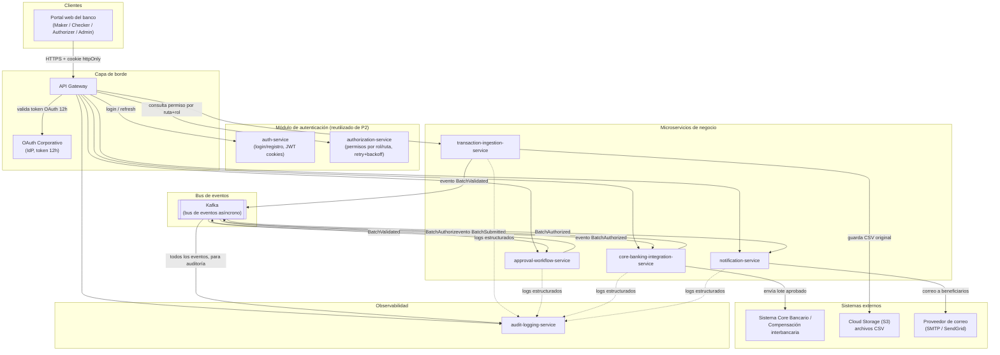

**Lectura del diagrama:** el portal solo habla con el **API Gateway**, que
valida el token OAuth corporativo y consulta al `authorization-service`
(igual que en la Práctica 2) si el rol del usuario puede acceder a la ruta
solicitada. Los microservicios de negocio se comunican entre sí de forma
**síncrona por REST** cuando necesitan una respuesta inmediata (ej. el
Gateway pidiendo el estado de un lote) y de forma **asíncrona por Kafka**
cuando un paso del flujo de negocio dispara el siguiente (ingestión →
aprobación → envío al core → notificación), desacoplando a los servicios
entre sí.

---

## 3. Integración con el módulo de autenticación de la Práctica 2

Se reutiliza tal cual la arquitectura de la Práctica 2:

- **`auth-service`** sigue siendo responsable de login/registro y de emitir
  el JWT en cookies `httpOnly` con renovación automática dentro de la
  ventana de gracia configurable.
- **`authorization-service`** sigue siendo el microservicio independiente
  que decide `allowed: true/false` por `{token, route}`, consultado con el
  mismo ciclo de reintentos con backoff exponencial ya implementado.

**Extensión para este dominio bancario:** el enum de roles se amplía de
`ADMIN | CLIENTE` (P2) a los roles operativos que exige el esquema
maker-checker-authorizer:

| Rol | Puede hacer |
|---|---|
| `MAKER` | Cargar/preparar un lote de transacciones (CSV) |
| `CHECKER` | Revisar y aprobar/rechazar un lote ya cargado (paso 2) |
| `AUTHORIZER` | Dar el visto bueno final para enviar el lote al core bancario (paso 3) |
| `ADMIN` | Administración general, consulta de historial y logs de auditoría |

La tabla de permisos por ruta del `authorization-service` (el mismo patrón
de `src/permissions.ts` de la Práctica 2) se extiende con las nuevas rutas,
por ejemplo:

```
POST /batches                     -> [MAKER, ADMIN]
POST /batches/:id/checker-review  -> [CHECKER, ADMIN]
POST /batches/:id/authorize       -> [AUTHORIZER, ADMIN]
GET  /batches                     -> [MAKER, CHECKER, AUTHORIZER, ADMIN]
GET  /audit-logs                  -> [ADMIN]
```

Adicionalmente, el **API Gateway** valida primero el token del **OAuth
corporativo** (vida de 12 horas, emitido por el IdP corporativo del banco)
antes de reenviar la petición; el JWT de sesión de aplicación (cookies
httpOnly de P2) se usa para la autorización fina rol→ruta dentro de la
plataforma. Esto separa dos preocupaciones: "¿eres empleado autenticado del
banco?" (OAuth corporativo) de "¿tu rol dentro de esta app puede hacer
esto?" (módulo de P2).

---

## 4. Diseño de microservicios

Se definen **5 microservicios de negocio** (mínimo pedido: 3), más los 2
reutilizados de la Práctica 2, cada uno con **base de datos propia** —
ningún servicio accede directamente a la base de datos de otro; toda
comunicación cruzada es por API o eventos.

| Microservicio | Responsabilidad única | Base de datos |
|---|---|---|
| `transaction-ingestion-service` | Recibir el CSV, parsear filas, validar reglas de negocio (saldo, límites, cuentas válidas, fraude), guardar el archivo original en Cloud Storage y mantener el historial consultable/descargable de lotes | PostgreSQL propia (`ingestion_db`) |
| `approval-workflow-service` | Orquestar el flujo maker-checker-authorizer: quién aprobó cada paso, en qué orden, con qué comentario | PostgreSQL propia (`approval_db`) |
| `core-banking-integration-service` | Enviar los lotes ya autorizados al sistema core bancario externo, con reintentos ante fallas temporales, y registrar la respuesta | PostgreSQL propia (`core_integration_db`) |
| `notification-service` | Enviar el correo "transacción en proceso" a cada beneficiario del lote una vez autorizado | PostgreSQL propia (`notification_db`) |
| `audit-logging-service` | Almacenar de forma centralizada y auditable todos los eventos de negocio y los logs técnicos de cada servicio, con API de consulta | Elasticsearch (`audit-logs-*`) — ver justificación en la sección 11 |

**Por qué esta separación:** cada servicio tiene una única razón para
cambiar (principio de responsabilidad única a nivel de servicio). Por
ejemplo, cambiar la lógica de validación de fraude solo toca
`transaction-ingestion-service`; agregar un cuarto aprobador al flujo solo
toca `approval-workflow-service`; cambiar de proveedor de correo solo toca
`notification-service`. Ningún servicio comparte tablas con otro — se
referencian entre sí solo por `batchId` (UUID), nunca por llave foránea
cruzando bases de datos.

---

## 5. Diagramas ER por microservicio

### 5.1 `transaction-ingestion-service`

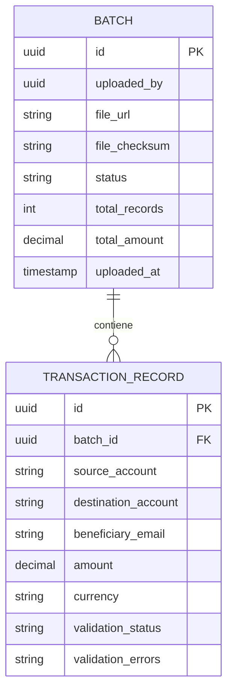

### 5.2 `approval-workflow-service`

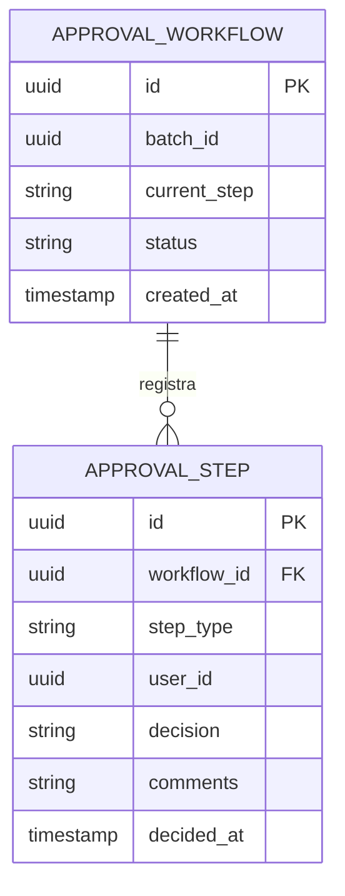

### 5.3 `core-banking-integration-service`

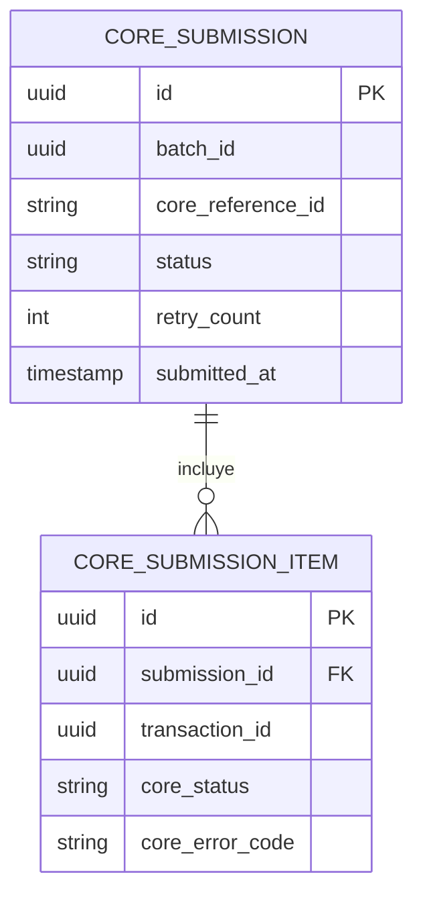

### 5.4 `notification-service`

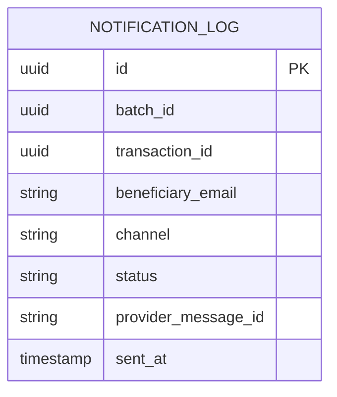

### 5.5 `audit-logging-service`

No es relacional (ver sección 11); el "modelo" equivalente es un documento
indexado en Elasticsearch:

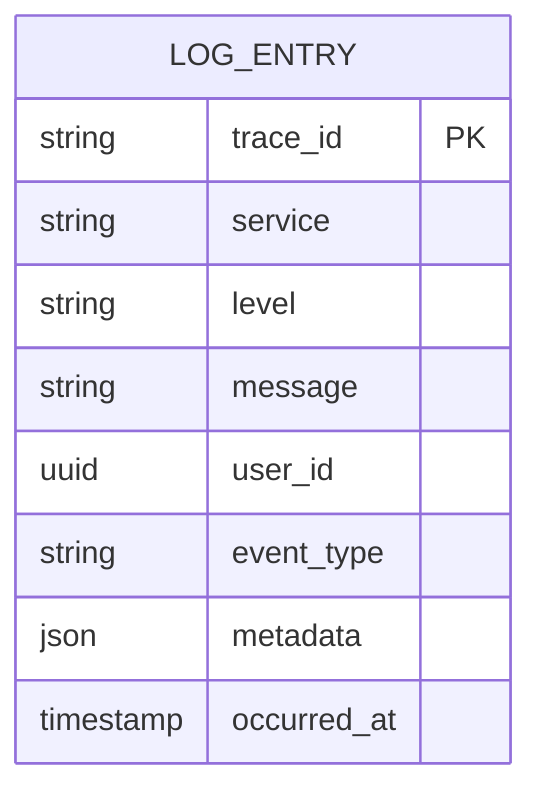

---

## 6. Diagramas de clases UML por microservicio

### 6.1 `transaction-ingestion-service`

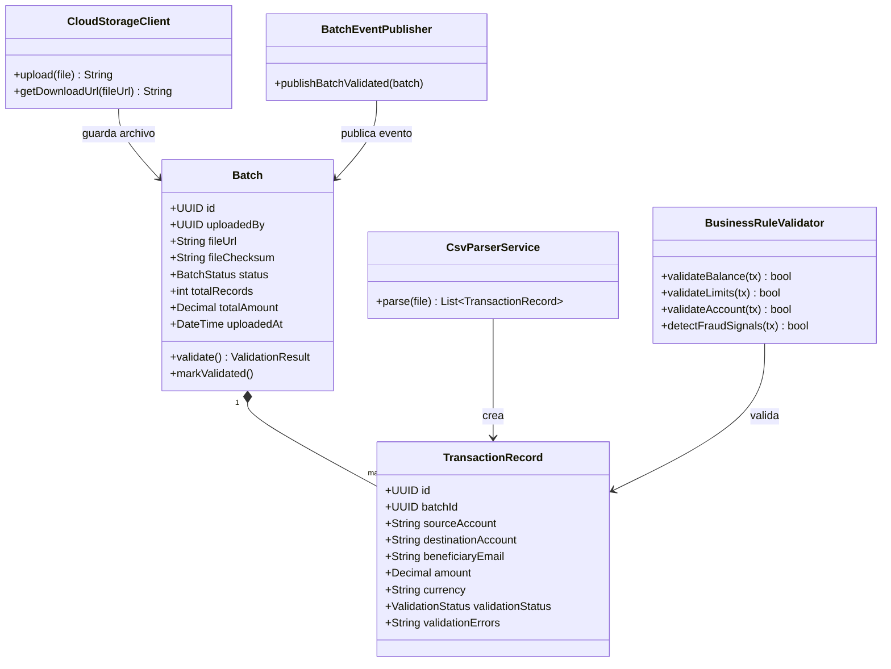

### 6.2 `approval-workflow-service`

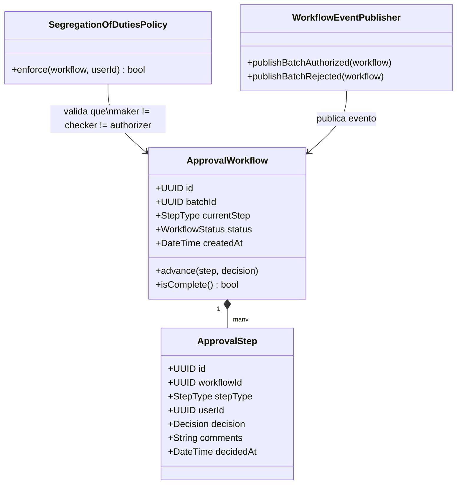

### 6.3 `core-banking-integration-service`

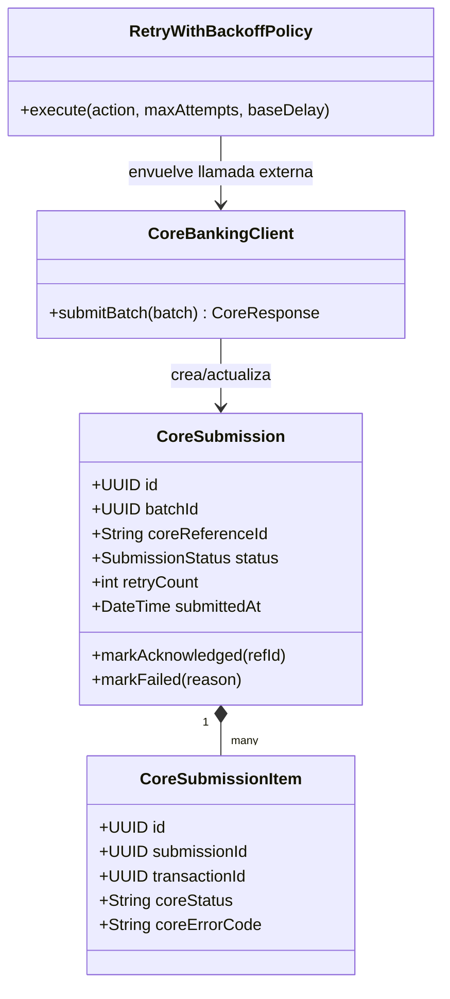

### 6.4 `notification-service`

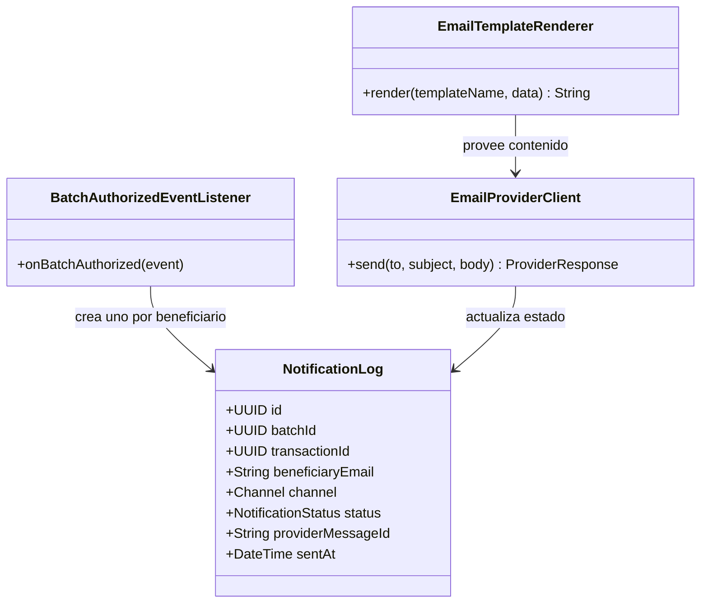

### 6.5 `audit-logging-service`

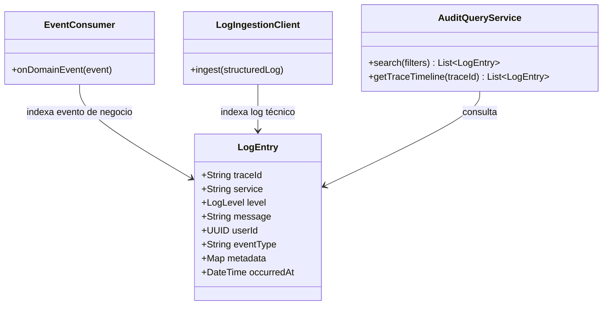

---

## 7. Flujo de aprobación de 3 pasos (maker-checker-authorizer)

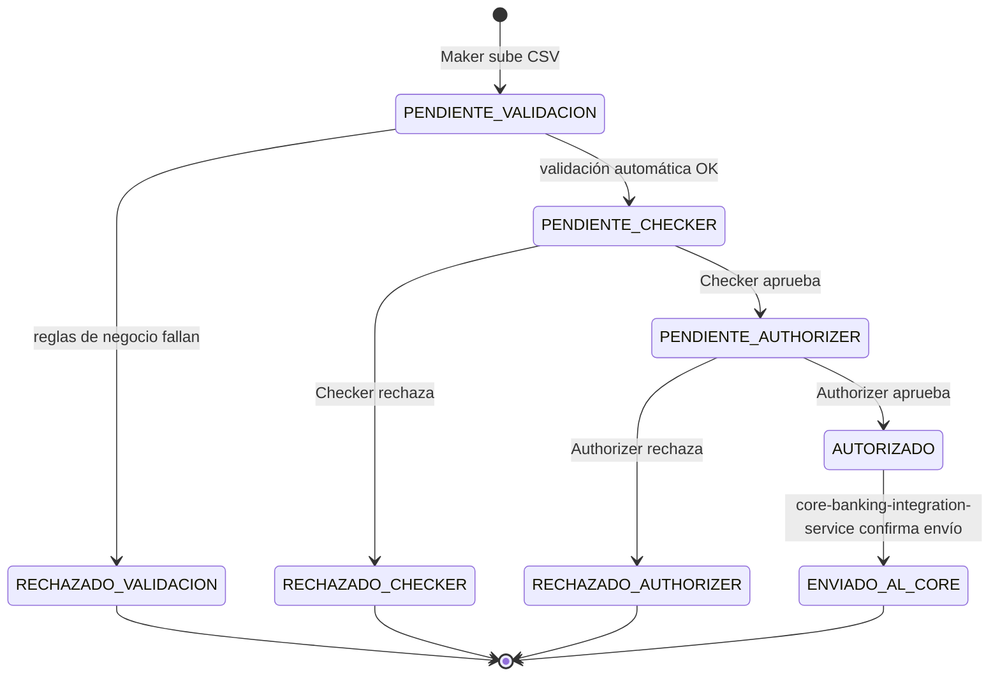

**Reglas del flujo:**

1. **Maker** carga el lote (CSV). `transaction-ingestion-service` valida
   automáticamente las reglas de negocio (saldo, límites, cuentas
   válidas, señales de fraude). Si falla, el lote se rechaza sin llegar a
   revisión humana.
2. **Checker** revisa el lote validado y decide aprobar o rechazar. El
   Checker **no puede ser la misma persona que el Maker** (segregación de
   funciones, aplicada por `SegregationOfDutiesPolicy` en
   `approval-workflow-service`, verificando el `userId` contra los pasos
   anteriores del mismo `workflowId`).
3. **Authorizer** da el visto bueno final. Tampoco puede ser el Maker ni
   el Checker del mismo lote. Al aprobar, `approval-workflow-service`
   publica el evento `BatchAuthorized`, que dispara en paralelo:
   - `core-banking-integration-service` → envía el lote al sistema core.
   - `notification-service` → envía el correo a cada beneficiario.

Cualquier rechazo en cualquier paso termina el flujo para ese lote sin
enviarlo al core bancario ni notificar a los beneficiarios.

---

## 8. Diagramas de secuencia — flujos críticos

### 8.1 Carga y validación del CSV

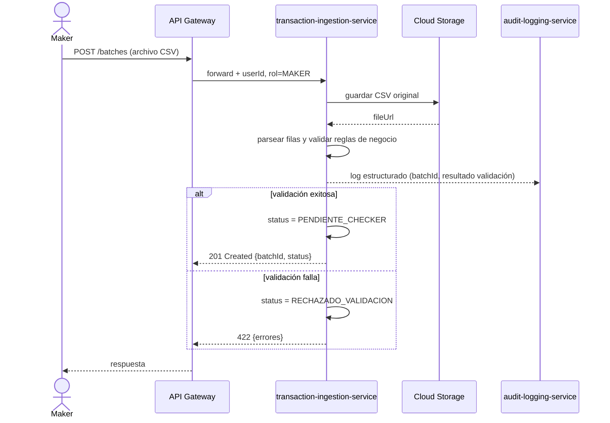

### 8.2 Flujo de aprobación de 3 pasos

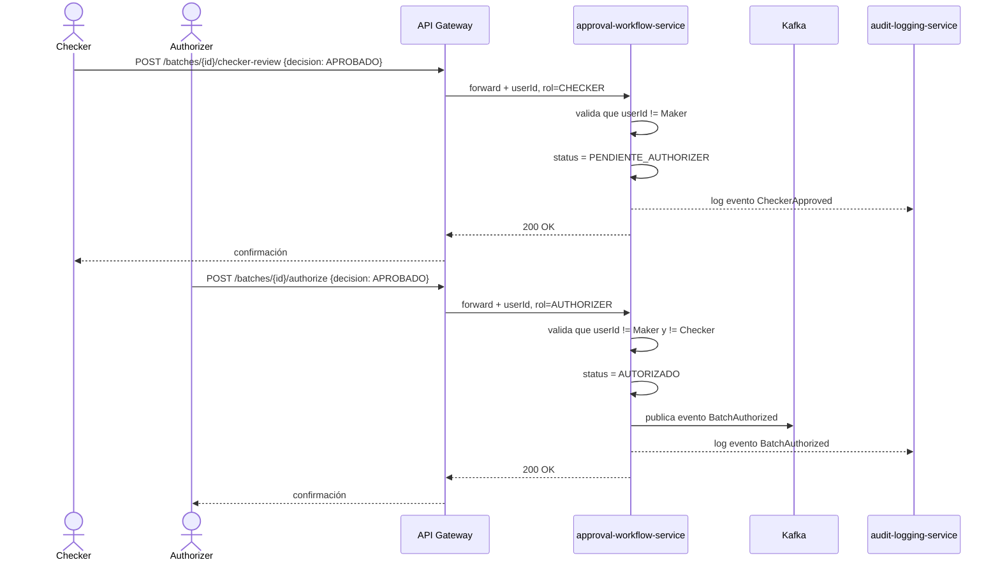

### 8.3 Envío al core bancario y notificación a clientes

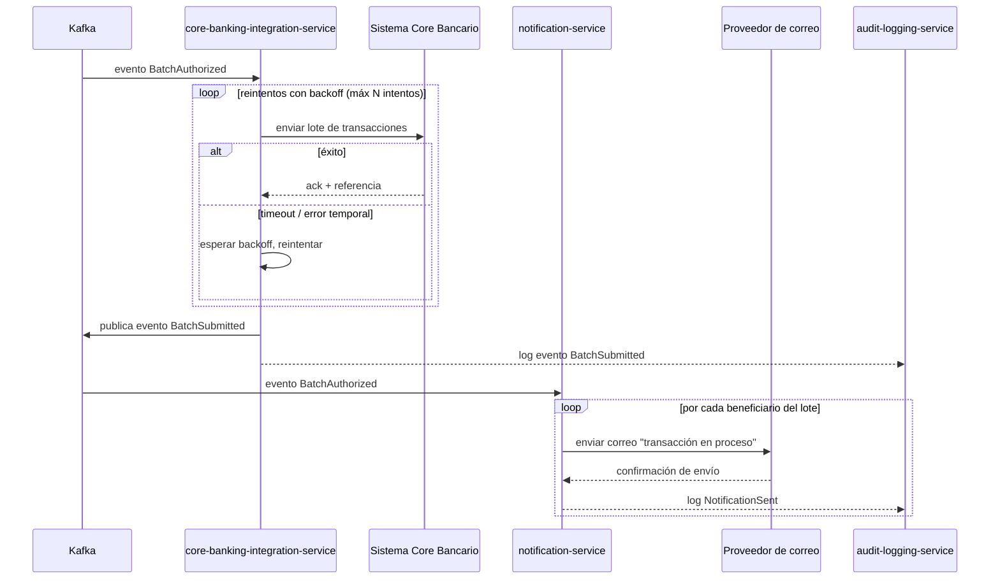

---

## 9. Diagrama de componentes

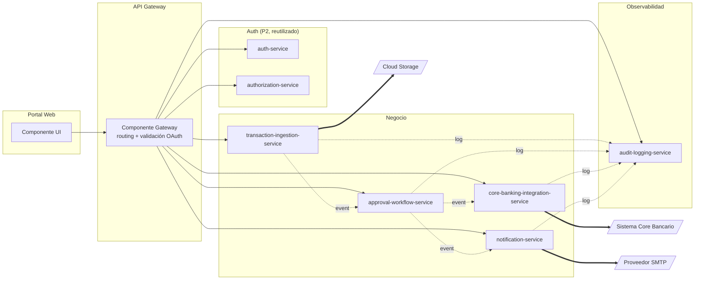

---

## 10. Estrategia de almacenamiento de archivos CSV

- **Dónde:** bucket de **Cloud Storage (S3-compatible)**, un objeto por
  lote: `s3://banco-transacciones-batches/{batchId}/original.csv`.
- **Quién escribe/lee:** solo `transaction-ingestion-service` tiene
  credenciales de escritura al bucket; el resto de servicios nunca acceden
  al archivo directamente, solo a la referencia `fileUrl` que
  `transaction-ingestion-service` expone por API.
- **Metadatos en base de datos relacional:** `fileUrl`, `fileChecksum`
  (SHA-256 del archivo, para detectar manipulación posterior),
  `uploadedBy`, `uploadedAt`, `totalRecords`, `totalAmount` — todo vive en
  la tabla `Batch` de `transaction-ingestion-service` (ver sección 5.1).
- **Descarga (historial consultable):** `GET /batches/{id}/download`
  genera una **URL prefirmada (presigned URL)** de corta duración (ej. 5
  minutos) en vez de sacar el archivo por el propio servicio, para no
  cargar ancho de banda innecesario en el microservicio.
- **Retención:** los archivos originales se retienen según política de
  cumplimiento bancario (ej. 7 años), moviéndose a almacenamiento de
  menor costo (cold storage / Glacier) después de 90 días sin acceso.
- **Cifrado:** cifrado en reposo (SSE-S3/KMS) y en tránsito (HTTPS/TLS),
  igual que los datos sensibles cifrados con AES en el módulo de la
  Práctica 2.

---

## 11. Estrategia de logging centralizado

**Dos flujos de información distintos que confluyen en `audit-logging-service`:**

1. **Eventos de negocio** (`BatchValidated`, `CheckerApproved`,
   `BatchAuthorized`, `BatchSubmitted`, `NotificationSent`, etc.) — cada
   microservicio los publica en Kafka; `audit-logging-service` los
   consume todos (es un consumidor más del bus) y los indexa. Esto forma
   el **rastro de auditoría** de negocio: quién hizo qué y cuándo.
2. **Logs técnicos estructurados** (JSON) de cada servicio — cada
   microservicio emite logs con un `traceId` común (propagado por el API
   Gateway en un header, ej. `X-Trace-Id`, en cada petición entrante), que
   un agente (Filebeat/Fluent Bit como sidecar) recolecta y envía al
   almacén centralizado.

**Almacén elegido: Elasticsearch** (en vez de una base relacional como el
resto de servicios), porque el caso de uso es búsqueda de texto libre y
agregaciones sobre grandes volúmenes de logs, para lo cual una base
relacional no está optimizada. Se documenta como una **desviación
justificada** del requerimiento general de "una base de datos por
microservicio" — sigue siendo una base de datos propia y exclusiva de
`audit-logging-service`, solo que no relacional.

**Consulta:** `audit-logging-service` expone:
- `GET /audit-logs?service=&level=&from=&to=&userId=` — búsqueda filtrada.
- `GET /audit-logs/trace/{traceId}` — línea de tiempo completa de una
  operación específica, cruzando los logs de todos los servicios que
  participaron en ella.

Adicionalmente se recomienda un dashboard (Kibana) para el equipo de
cumplimiento/operaciones, fuera del alcance de la API pero apoyado en el
mismo índice de Elasticsearch.

---

## 12. Comunicación entre servicios (REST y mensajería)

| Interacción | Tipo | Por qué |
|---|---|---|
| Portal → API Gateway | REST (síncrono) | El usuario necesita una respuesta inmediata (éxito/error de su acción) |
| API Gateway → auth-service / authorization-service | REST (síncrono) | Decisión de acceso debe resolverse antes de continuar la petición |
| API Gateway → cualquier microservicio de negocio (consultas, altas) | REST (síncrono) | Operaciones CRUD directas iniciadas por un usuario |
| `transaction-ingestion-service` → `approval-workflow-service` | **Asíncrono (Kafka, evento `BatchValidated`)** | El ingreso del lote no debe bloquearse esperando que arranque el flujo de aprobación |
| `approval-workflow-service` → `core-banking-integration-service` / `notification-service` | **Asíncrono (Kafka, evento `BatchAuthorized`)** | Un mismo evento dispara **dos** acciones independientes en paralelo (envío al core + notificación); si fueran llamadas REST directas, un fallo en una bloquearía o acoplaría a la otra |
| `core-banking-integration-service` → Sistema Core Bancario externo | REST síncrono, con **retry + backoff exponencial** (mismo patrón que `AuthorizationClientService` de la Práctica 2) | Es una llamada a un sistema externo que puede fallar temporalmente; no es apropiado para eventos porque necesitamos la respuesta (referencia del core) para continuar |
| Todos los servicios → `audit-logging-service` | **Asíncrono** (eventos Kafka + logs vía agente) | El logging nunca debe bloquear ni hacer fallar la operación de negocio que lo origina |

**Por qué esta combinación:** REST donde el usuario espera una respuesta
inmediata; eventos donde un paso de negocio **dispara** el siguiente sin
que el servicio origen necesite saber quién ni cuántos consumidores
reaccionarán (bajo acoplamiento, fácil agregar un nuevo consumidor —por
ejemplo, un futuro servicio de reportería— sin tocar el servicio que
publica el evento).

---

## 13. Propuesta de API Gateway

**Responsabilidades del Gateway:**

1. **Punto único de entrada** para el portal — el cliente nunca conoce las
   URLs internas de los microservicios.
2. **Validación del token OAuth corporativo** (12 horas de vida) en cada
   petición entrante, antes de reenviarla.
3. **Propagación del `traceId`** (header `X-Trace-Id`) para correlacionar
   logs entre servicios (sección 11).
4. **Enrutamiento** a cada microservicio según el path (`/batches/*` →
   `transaction-ingestion-service`, `/approvals/*` →
   `approval-workflow-service`, etc.).
5. **Rate limiting** por usuario/rol, para proteger a los microservicios
   de picos de carga (justo el problema que hoy sufre el monolito).
6. **No decide autorización fina por sí mismo** — delega esa decisión al
   `authorization-service` de la Práctica 2, manteniendo la autorización
   desacoplada del enrutamiento.

**Tecnología sugerida:** Kong o un API Gateway administrado (AWS API
Gateway / Azure API Management), configurado declarativamente (Gateway
como código), en vez de construir uno propio — es infraestructura
transversal, no lógica de negocio.

---

## 14. Tecnologías y patrones de diseño

| Tecnología / Patrón | Uso en este diseño |
|---|---|
| **API Gateway pattern** | Punto único de entrada, desacopla al cliente de la topología interna de microservicios |
| **Database per service** | Cada microservicio tiene su propia base de datos; ningún JOIN cruza límites de servicio |
| **Maker-Checker-Authorizer (segregación de funciones / four-eyes principle)** | Controla que ninguna persona apruebe sola una transacción bancaria, exigido por control interno |
| **Event-driven architecture / Choreography** | Los servicios reaccionan a eventos de Kafka en vez de que un orquestador central llame a cada uno; cada servicio decide su propia reacción al evento `BatchAuthorized` |
| **Retry with exponential backoff** | Reutilizado del `AuthorizationClientService` de la Práctica 2, aplicado ahora también a la llamada al sistema core bancario externo |
| **Circuit breaker (recomendado, evolución futura)** | Para evitar que reintentos continuos contra un core bancario caído saturen `core-banking-integration-service` |
| **Presigned URL pattern** | Descarga de CSV sin pasar el archivo por el propio microservicio |
| **Centralized structured logging + trace correlation** | `traceId` propagado por el Gateway, consumido en `audit-logging-service` |
| **JWT en cookies httpOnly + microservicio de autorización desacoplado** | Reutilizado íntegramente de la Práctica 2 |

