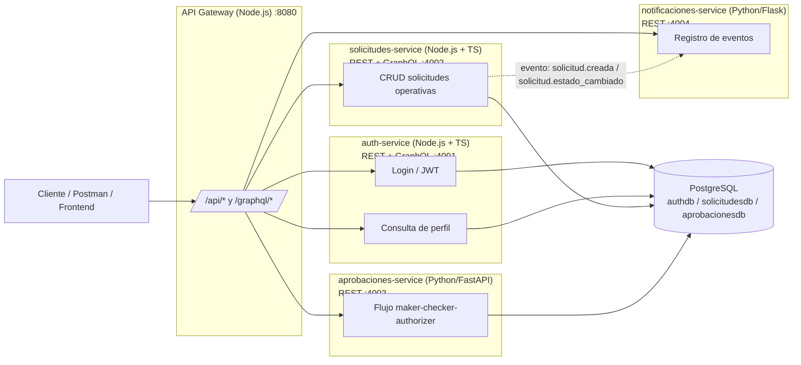

# Diagrama de Arquitectura

Comunicación entre servicios: todo el tráfico externo entra por el **API Gateway**,
que enruta hacia cada microservicio. Ningún microservicio llama directamente a otro,
excepto `solicitudes-service`, que publica eventos hacia `notificaciones-service`
(comunicación asíncrona de notificación, no de consulta).

**Notas:**
- El Gateway es el único punto de entrada (patrón *API Gateway*), evitando que el
  cliente conozca las direcciones internas de cada microservicio.
- `auth-service` y `solicitudes-service` exponen tanto REST como GraphQL.
- `solicitudes-service` → `notificaciones-service` es la única comunicación
  directa entre microservicios (fuera del Gateway), usada solo para notificar
  eventos de forma asíncrona (fire-and-forget), no para leer datos.
