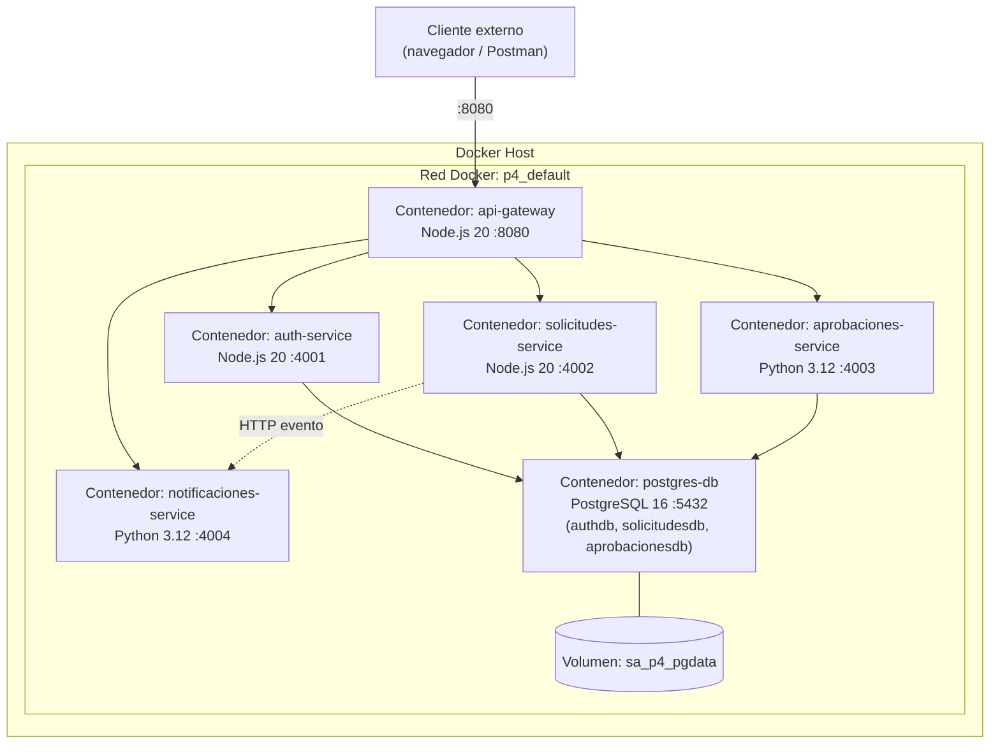

# Diagrama de Despliegue

Todos los servicios corren como contenedores Docker independientes, orquestados
por `docker-compose.yml`, dentro de una misma red Docker (`sa-p4-network`, creada
implícitamente por Compose).



**Comando único de despliegue:**

```bash
docker compose up --build
```

Esto construye las 5 imágenes (gateway + 4 microservicios), levanta Postgres,
ejecuta el script `db-init/init.sql` para crear las 3 bases de datos y sus
tablas, y expone el sistema completo en `http://localhost:8080`.
