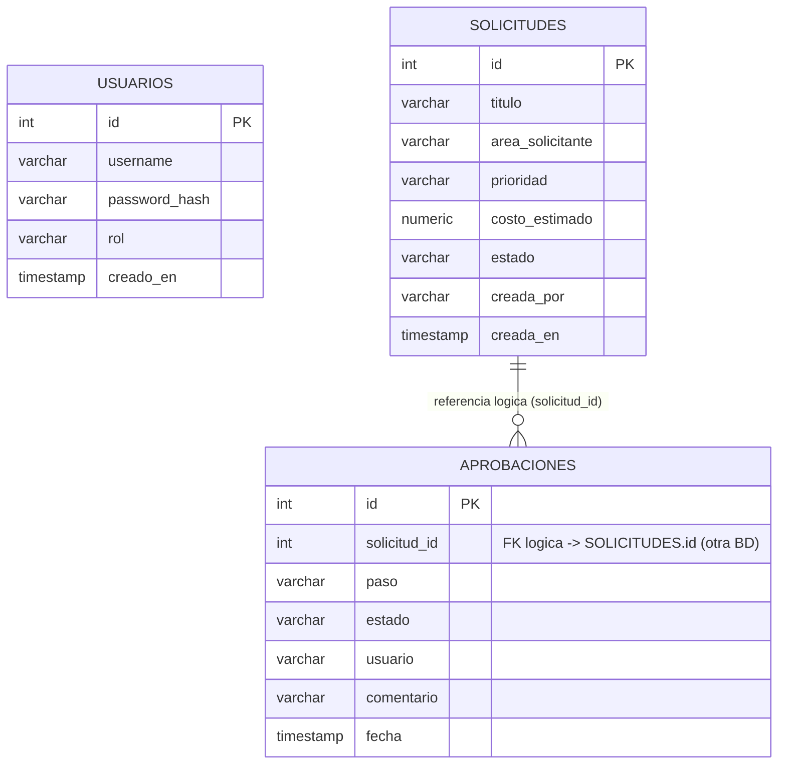

# Diagrama Entidad-Relación

Cada microservicio tiene su propia base de datos (independencia de datos entre
servicios). No existen llaves foráneas físicas entre bases distintas; la relación
entre `solicitudes.id` y `aprobaciones.solicitud_id` es una **referencia lógica**
que cada servicio resuelve por API, no por JOIN de base de datos.

**Bases de datos:**

| Base de datos      | Microservicio           | Tabla(s)     |
|---------------------|--------------------------|--------------|
| `authdb`            | auth-service             | `usuarios`   |
| `solicitudesdb`      | solicitudes-service       | `solicitudes`|
| `aprobacionesdb`     | aprobaciones-service      | `aprobaciones`|

`notificaciones-service` no persiste en base de datos relacional; mantiene el
historial de eventos en memoria durante la vida del contenedor.
