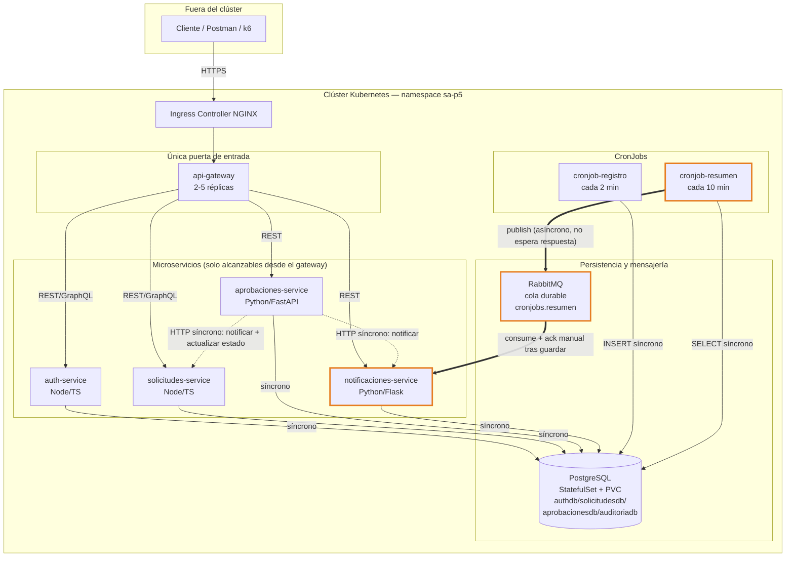

# Práctica 5 — Documentación técnica

> Plantilla generada a partir del código de la Práctica 4. Antes de entregar,
> **completá cada sección marcada como `[COMPLETAR]`** con la evidencia real
> obtenida al ejecutar los comandos en tu propio clúster — el enunciado exige
> evidencias reales, no solo la estructura.

## 1. Diagrama de arquitectura



**Flujo asíncrono (requisito D/H):** `cronjob-resumen` calcula el resumen y
publica en la cola durable `cronjobs.resumen` y termina de inmediato (no
espera a que nadie lo procese). `notificaciones-service` corre un
consumidor en un hilo de fondo (`consumer.py`) que toma el mensaje, lo
guarda en `auditoriadb.resumenes_cronjob` y **solo entonces** hace `ack`.
Si `notificaciones-service` está caído, los mensajes se acumulan en la
cola (es durable) y se procesan sin pérdida cuando el pod vuelve a estar
disponible — comportamiento a evidenciar en la sección 4.

**Límites impuestos por NetworkPolicies** (ver `templates/networkpolicies.yaml`):
- Todo el tráfico de ingreso está denegado por defecto (`default-deny-ingress`).
- Solo `api-gateway` acepta tráfico desde cualquier origen (es la puerta de entrada).
- `auth-service` y `aprobaciones-service` solo aceptan tráfico del gateway.
- `solicitudes-service` acepta tráfico del gateway y de `aprobaciones-service`.
- `notificaciones-service` acepta tráfico del gateway, `solicitudes-service` y `aprobaciones-service`.
- PostgreSQL solo acepta conexiones de los 4 microservicios y de ambos CronJobs.
- RabbitMQ **solo** acepta conexiones de `notificaciones-service` y `cronjob-resumen`
  (ni `auth-service`, ni `solicitudes-service`, ni `aprobaciones-service`, ni
  `cronjob-registro` pueden alcanzarlo).

## 2. Comandos reproducibles (de clúster vacío a plataforma funcionando)

```bash
# 0. Prerrequisitos: Docker, un clúster local (minikube/kind/k3s) con
#    metrics-server e Ingress Controller habilitados, Helm 3, kubectl.
minikube start --cpus=4 --memory=6144 --addons=ingress,metrics-server

# 1. Construir las imágenes de los 5 servicios + 2 cronjobs.
#    (con minikube, apuntar el daemon docker del host al del clúster)
eval $(minikube docker-env)
for svc in auth-service solicitudes-service aprobaciones-service notificaciones-service api-gateway; do
  docker build -t registry.example.com/sa-p5/$svc:dev ./$svc
done
docker build -t registry.example.com/sa-p5/cronjob-registro:dev ./cronjobs/cronjob1-registro
docker build -t registry.example.com/sa-p5/cronjob-resumen:dev ./cronjobs/cronjob2-resumen

# 2. Resolver dependencias del chart (PostgreSQL y RabbitMQ de bitnami).
cd charts/sa-platform
helm repo add bitnami https://charts.bitnami.com/bitnami
helm dependency update

# 3. Copiar el ejemplo de valores y reemplazar el carné del estudiante.
cp values.example.yaml values.local.yaml
# editar values.local.yaml: global.estudianteCarne y credenciales si se desea

# 4. Verificar el chart antes de instalar.
helm lint . -f values.local.yaml -f values-dev.yaml

# 5. Instalar (--create-namespace es el mecanismo NATIVO de Helm para crear
#    el namespace del release: sigue siendo "creado por el chart", nunca un
#    `kubectl create namespace` manual aparte).
helm install sa-platform . -n sa-p5 --create-namespace \
  -f values.local.yaml -f values-dev.yaml

# 6. Verificar que todo llegó a Running/Ready.
kubectl get pods -n sa-p5 -w

# 7. Agregar el host del Ingress al /etc/hosts local.
echo "$(minikube ip) sa-platform.local" | sudo tee -a /etc/hosts

# 8. Probar de punta a punta.
curl -X POST http://sa-platform.local/api/auth/login \
  -H "Content-Type: application/json" \
  -d '{"username":"mgarcia","password":"admin123"}'
```

### Ciclo de vida con Helm (versionado, upgrade, rollback)

```bash
# Publicar version 1.0.0 (Chart.yaml ya la trae). Tras un cambio menor,
# subir version/appVersion en Chart.yaml a 1.0.1 y:
helm upgrade sa-platform . -n sa-p5 -f values.local.yaml -f values-dev.yaml

# Ver historial de releases.
helm history sa-platform -n sa-p5

# Revertir a la revisión anterior.
helm rollback sa-platform <REVISION_ANTERIOR> -n sa-p5
helm history sa-platform -n sa-p5   # confirmar que el rollback quedo registrado
```

`[COMPLETAR]`: pegar aquí la salida real de `helm history sa-platform -n sa-p5`
mostrando al menos 2 revisiones, el upgrade y el rollback.

## 3. Tabla comparativa de tamaño de imágenes

| Servicio | Antes (base sin optimizar) | Después (multi-stage + alpine/slim) | Reducción |
|---|---|---|---|
| auth-service | `[COMPLETAR]` | `[COMPLETAR]` | `[COMPLETAR]` |
| solicitudes-service | `[COMPLETAR]` | `[COMPLETAR]` | `[COMPLETAR]` |
| aprobaciones-service | `[COMPLETAR]` | `[COMPLETAR]` | `[COMPLETAR]` |
| notificaciones-service | `[COMPLETAR]` | `[COMPLETAR]` | `[COMPLETAR]` |
| api-gateway | `[COMPLETAR]` | `[COMPLETAR]` | `[COMPLETAR]` |
| cronjob-registro | `[COMPLETAR]` | `[COMPLETAR]` | `[COMPLETAR]` |
| cronjob-resumen | `[COMPLETAR]` | `[COMPLETAR]` | `[COMPLETAR]` |

Comando para medir: `docker images | grep sa-p5`. Para el "antes", construir
una versión de referencia con `FROM node:20` / `FROM python:3.12` (sin
`-alpine`/`-slim` y sin multi-stage) y comparar contra las imágenes finales
de este repositorio.

## 4. Evidencias requeridas

Cada punto debe llevar el comando ejecutado y su salida real (texto o
captura) debajo del placeholder.

1. **`helm history` con rollback** — `[COMPLETAR]`
2. **Escalado por HPA bajo carga** —
   `kubectl get hpa -n sa-p5 -w` y `kubectl get pods -n sa-p5 -w` durante
   `k6 run scripts/load-test.js` — `[COMPLETAR]`
3. **Persistencia tras borrado del pod de BD**:
   ```bash
   kubectl exec -n sa-p5 sa-platform-postgresql-0 -- psql -U sa_user -d authdb -c "SELECT username FROM usuarios;"
   kubectl delete pod sa-platform-postgresql-0 -n sa-p5
   kubectl wait --for=condition=Ready pod/sa-platform-postgresql-0 -n sa-p5 --timeout=120s
   kubectl exec -n sa-p5 sa-platform-postgresql-0 -- psql -U sa_user -d authdb -c "SELECT username FROM usuarios;"
   ```
   `[COMPLETAR]` (pegar ambas salidas, deben coincidir)
4. **Bloqueo por NetworkPolicy** (ej. `auth-service` intentando llegar al broker,
   algo que NO está permitido):
   ```bash
   kubectl exec -n sa-p5 deploy/sa-platform-auth-service -- \
     wget -qO- --timeout=5 http://sa-platform-rabbitmq:15672 || echo "BLOQUEADO (esperado)"
   ```
   `[COMPLETAR]`
5. **Actualización sin downtime**: correr `while true; do curl -s -o /dev/null -w "%{http_code}\n" http://sa-platform.local/health; sleep 0.5; done`
   en una terminal mientras se hace `helm upgrade` en otra — `[COMPLETAR]`

## 5. Resultados de la prueba de carga

| Métrica | Valor |
|---|---|
| Peticiones por segundo (RPS) | `[COMPLETAR]` |
| Latencia p95 | `[COMPLETAR]` |
| Tasa de error | `[COMPLETAR]` |
| Réplicas mín. → máx. observadas (HPA) | `[COMPLETAR]` |

## 6. Preguntas teóricas

**¿Qué es Helm y qué problema resuelve frente a los manifiestos sueltos?**
Helm es el gestor de paquetes de Kubernetes: empaqueta un conjunto de
manifiestos relacionados (un "chart") junto con sus valores parametrizables
en una unidad versionada e instalable con un solo comando. Frente a aplicar
manifiestos sueltos con `kubectl apply -f`, resuelve la falta de
versionado (no hay forma nativa de saber "qué versión de la app está
corriendo" ni de revertir un cambio), la falta de parametrización (values
por ambiente en vez de duplicar YAML), y la falta de atomicidad (un
`helm install/upgrade` se trata como una sola operación con historial,
mientras que una serie de `kubectl apply` puede dejar el clúster en un
estado parcial si falla a la mitad).

**¿Diferencia entre chart, release y repository?**
Un **chart** es el paquete: la definición de plantillas + valores por
defecto (lo que hay en `charts/sa-platform/`). Un **release** es una
instancia instalada de ese chart en un clúster con un nombre y un
namespace concretos (ej. `sa-platform` en `sa-p5`); el mismo chart puede
instalarse varias veces como releases distintos. Un **repository** es
donde se publican y distribuyen charts para que otros los descarguen (ej.
`https://charts.bitnami.com/bitnami`, de donde viene la dependencia de
PostgreSQL y RabbitMQ de este proyecto).

**¿Qué es un StatefulSet y cuándo NO usarlo?**
Es el controlador de Kubernetes pensado para cargas con estado: a
diferencia de un Deployment, da a cada réplica una identidad de red
estable (nombre `<sts>-0`, `<sts>-1`, ...) y su propio PersistentVolumeClaim
que persiste aunque el pod se reprograme o se borre. Se usa aquí para
PostgreSQL, donde perder o mezclar el volumen de datos sería inaceptable.
NO debe usarse para cargas sin estado que no necesitan identidad estable
ni almacenamiento propio por réplica (como los microservicios de este
proyecto): forzar un StatefulSet ahí solo agrega complejidad de despliegue
(orden de arranque secuencial, sin el paralelismo de un Deployment) sin
ningún beneficio real.

**¿Diferencia entre liveness, readiness y startup probe?**
La **startup probe** le da tiempo al contenedor a terminar su arranque en
frío (compilar/cargar dependencias) antes de que liveness/readiness
empiecen a evaluarlo — si no existiera, un arranque lento podría matarse
por un liveness impaciente. La **readiness probe** decide si el pod debe
recibir tráfico del Service en este momento: si falla, el pod se saca
temporalmente de la rotación pero NO se reinicia. La **liveness probe**
decide si el contenedor está "vivo" de verdad: si falla repetidamente,
Kubernetes lo reinicia, asumiendo que quedó en un estado del que no puede
recuperarse solo (deadlock, memory leak severo, etc.).

**¿Qué es una NetworkPolicy y por qué el tráfico es permitido por defecto?**
Es un recurso que restringe el tráfico de red (ingress y/o egress) entre
pods según selectores de labels/namespace. Kubernetes permite todo el
tráfico entre pods por defecto porque el modelo de red del clúster nació
"flat" (cualquier pod puede hablarle a cualquier otro) para simplificar el
caso general; las NetworkPolicies son opt-in: en cuanto existe al menos
una policy que selecciona un pod, ese pod pasa a denegar todo lo que no
esté explícitamente permitido en alguna policy (de ahí el patrón
`default-deny` + reglas puntuales usado en este chart).

**¿Qué es un PodDisruptionBudget?**
Define cuántas réplicas de una aplicación pueden estar simultáneamente
fuera de servicio por una **disrupción voluntaria** (drenar un nodo para
mantenimiento, un `kubectl delete` masivo, un upgrade del clúster) sin
violar la disponibilidad mínima que el equipo considera aceptable. No
protege contra caídas involuntarias (un crash de la app); ahí interviene
readiness/liveness, no el PDB.

**¿Qué ventajas y qué nuevos problemas introduce la comunicación asíncrona?**
Ventajas: desacopla al productor del consumidor en el tiempo (el productor
no espera, como en `cronjob-resumen`), amortigua picos de carga (la cola
actúa de buffer), y tolera que el consumidor esté temporalmente caído sin
perder trabajo. Problemas nuevos: la consistencia deja de ser inmediata
(hay una ventana donde el dato "ya se publicó" pero "aún no se procesó"),
hay que diseñar explícitamente para mensajes duplicados o fuera de orden
(idempotencia — por eso `resumenes_cronjob` usa `ON CONFLICT` sobre
`(hora_bucket, carne)`), y depurar un flujo asíncrono es más difícil
porque el error puede aparecer minutos después y en un proceso distinto
al que causó el problema.

**¿Qué hace `helm rollback` internamente?**
Helm guarda en el clúster (como Secrets, por defecto) el manifiesto
renderizado completo de cada revisión de un release. `helm rollback` no
"deshace cambios": toma el manifiesto ya renderizado de la revisión
destino y lo vuelve a aplicar contra el clúster con `kubectl apply`
equivalente, generando además una **nueva** revisión en el historial (por
ejemplo, si estabas en la revisión 3 y vuelves a la 1, el resultado queda
registrado como revisión 4 con el contenido de la 1) — el historial nunca
se trunca ni se reescribe hacia atrás.
