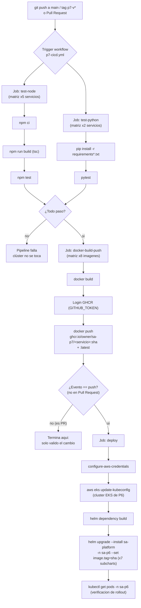

# Diagrama del pipeline

**Fases (según lo pedido en el enunciado):**

1. **Validar cambios automáticamente** → jobs `test-node` + `test-python`.
2. **Construir imágenes Docker** → job `docker-build-push` (build).
3. **Ejecutar pruebas** → jobs `test-node` + `test-python` (antes de construir
   imágenes, para no publicar nada roto).
4. **Desplegar servicios sin intervención manual** → job `deploy` (`helm
   upgrade --install` automático sobre el clúster EKS de la Práctica 6).
